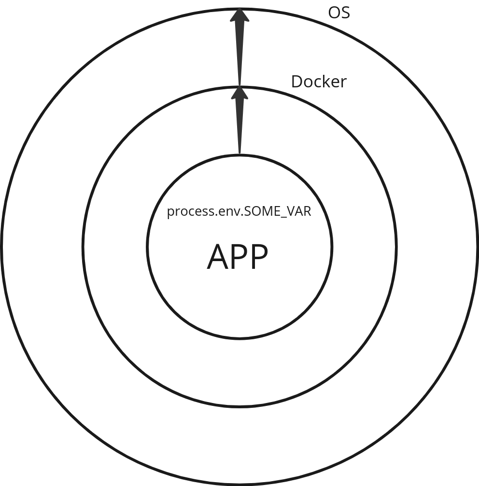

# Nestjs configuration
***
# 1. Переменные окружения

> * Переменная окружения — это переменная, значение которой устанавливается вне программы и может использоваться операционной системой или запущенными приложениями. Эти переменные содержат информацию, которая конфигурирует поведение системы или приложений.
> * Переменные окружения можно задавать и изменять через командную строку операционной системы, скрипты запуска, через настройки в интерфейсе операционной системы или программно в процессе работы приложения.
> * Управление переменными окружения и их использование позволяет разработчикам и системным администраторам адаптировать поведение приложений и операционных систем к конкретным условиям эксплуатации без изменения кода, что делает процесс разработки, развертывания и поддержки программного обеспечения более гибким и безопасным.
> * Переменные окружения в контексте бэкенд-приложений используются для хранения конфигурационных данных, которые могут меняться в зависимости от среды, в которой запускается приложение. Это могут быть данные для подключения к базам данных, API ключи, пути к файлам, настройки безопасности и прочее

# 2. [Nest configuration (ConfigModule)](https://docs.nestjs.com/techniques/configuration)
## 2.1. Пример реализации [configuration-file]()

`
    
    src/settings/configuration
    
    // https://docs.nestjs.com/techniques/configuration#custom-configuration-files
    enum Environments {
    DEVELOPMENT = 'DEVELOPMENT',
    STAGING = 'STAGING',
    PRODUCTION = 'PRODUCTION',
    TEST = 'TEST',
    }
    
    export type EnvironmentVariable = { [key: string]: string | undefined };
    
    export type ConfigurationType = ReturnType<typeof getConfig>;
    
    const getConfig = (
    environmentVariables: EnvironmentVariable,
    currentEnvironment: Environments,
    ) => {
    return {
    apiSettings: {
    PORT: Number.parseInt(environmentVariables.PORT || '3000'),
    LOCAL_HOST: environmentVariables.LOCAL_HOST || 'http://localhost:3007',
    PUBLIC_FRIEND_FRONT_URL: environmentVariables.PUBLIC_FRIEND_FRONT_URL, 
    },
    
    databaseSettings: {
          MONGO_CONNECTION_URI: environmentVariables.MONGO_CONNECTION_URI,
          MONGO_CONNECTION_URI_FOR_TESTS:
            environmentVariables.MONGO_CONNECTION_URI_FOR_TESTS,
        },
    environmentSettings: {
          currentEnv: currentEnvironment,
          isProduction: currentEnvironment === Environments.PRODUCTION,
          isStaging: currentEnvironment === Environments.STAGING,
          isTesting: currentEnvironment === Environments.TEST,
          isDevelopment: currentEnvironment === Environments.DEVELOPMENT,
        },
    };
    };
    
    export default () => {
    const environmentVariables = process.env;
    
    console.log('process.env.ENV =', environmentVariables.ENV);
    const currentEnvironment: Environments =
    environmentVariables.ENV as Environments;
    
    return getConfig(environmentVariables, currentEnvironment);
    };

В данном случае из файла configuration экспортируется функция, возвращающая объект, в котором сгруппированы связанные параметры конфигурации (например, параметры, связанные с базой данных). Обратите внимание на вложенный объект `environmentSettings`. Его свойства вычисляются в зависимости от текущего `process.env.ENV` Тип `ConfigurationType` (используется при инжектировании `ConfigService`) выводится из объекта с конфигурациями, т.о. не нужно отдельно описывать этот тип.

При необходимости, можно вывести тип вложенных объектов, например так:

 * `type DBSettingsType = ReturnType<typeof getConfig>['databaseSettings'];`

## 2.2. Регистрация модуля:

`src/app.module.ts
@Module({
// Регистрация модуля
imports: [
ConfigModule.forRoot({
isGlobal: true,
load: [configuration],
}),
//...`

## 2.3. Использование:

## Использование в провайдерах (сервисах):

`
src/some-service
constructor(private configService: ConfigService<ConfigurationType, true>) {
const environmentSettings = configService.get('environmentSettings', {
infer: true,
});
//...
}`

>Второй параметр generic ConfigService<ConfigurationType, true> (true) нужен если включен "strictNullChecks": true в tsconfig.json (рекомендуется включить для более строгой работы typescript).
>Опция { infer: true } нужна для автоматического вывода типа вложенного объекта в configuration.ts

* Использование в `useFactory` (при регистрации модуля, где нужна конфигурация):

`       
        
        src/app.module.ts
        //...
        MongooseModule.forRootAsync({
        useFactory: (configService: ConfigService<ConfigurationType, true>) => {
        const environmentSettings = configService.get('environmentSettings', {
        infer: true,
        });
        const databaseSettings = configService.get('databaseSettings', {
        infer: true,
        });

        const uri = environmentSettings.isTesting
          ? databaseSettings.MONGO_CONNECTION_URI_FOR_TESTS
          : databaseSettings.MONGO_CONNECTION_URI;
        console.log(uri);
 
        return {
          uri: uri,
        };
      },
      inject: [ConfigService],
    }),
    //...`

* Использование в main.ts:

`

    src/main.ts
    async function bootstrap() {
    const app = await NestFactory.create(AppModule);
    
    applyAppSettings(app);
    
    const configService = app.get(ConfigService<ConfigurationType, true>);
    const apiSettings = configService.get('apiSettings', { infer: true });
    const environmentSettings = configService.get('environmentSettings', {
    infer: true,
    });
    const port = apiSettings.PORT;
    
    await app.listen(port, () => {
    console.log('App starting listen port: ', port);
    console.log('ENV: ', environmentSettings.currentEnv);
    });`

# 3. [Nest configuration validate environments](https://docs.nestjs.com/techniques/configuration#schema-validation)
Будет дополнено...

# CQRS
*** 

>`CQRS` – подход проектирования программного обеспечения, при котором код, изменяющий состояние, отделяется от кода, просто читающего это состояние. Подобное разделение может быть логическим и основываться на разных уровнях. Кроме того, оно может быть физическим и включать разные звенья (tiers), или уровни.

>В основе этого подхода лежит принцип Command-query separation (`CQS`).

Основная идея CQS в том, что в объекте методы могут быть двух типов:

* Queries: Методы возвращают результат, не изменяя состояние объекта. Другими словами, у Query не никаких побочных эффектов.

* Commands: Методы изменяют состояние объекта, не возвращая значение.

Преимущества:

* Простота понимания: разделение операций чтения и записи позволяет создавать более чистый и модульный код.
* Улучшенная производительность: разделение операций чтения и записи позволяет оптимизировать каждую из них для конкретных задач.
* Улучшенная масштабируемость: разделение операций чтения и записи позволяет легко масштабировать каждую из них отдельно.
* Простота тестирования: разделение операций чтения и записи позволяет легко тестировать каждую из них отдельно.

1.1. Разбираем по [документации](https://docs.nestjs.com/recipes/cqrs):
* Для чего нам CQRS?
* Как работает шина?
* Как реализовать commandHandler?
* Как реализовать queryHandler?
* Как реализовать eventHandler? (обработка ошибок в ивентах!!!)
* Разделение по слоям, как определить что является командой, а что query?

> * Одна command = 1 обработчик (так как нам нужно дождаться результата)
> * Одна query = 1 обработчик (так как нам нужно дождаться результата)
> * Один event = множество обработчиков (результата не ждем и возвращаем ответ сервера, а в фоне ивенты делают необходимую работу)
  
Будет дополнено...
